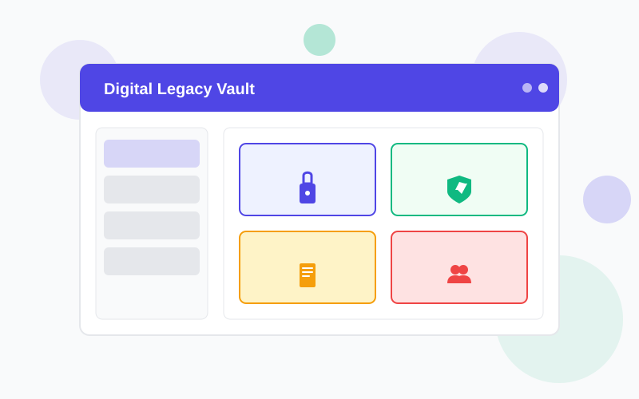

# Digital Legacy Vault Landing Page - Build Guide

A complete, step-by-step tutorial on how to build and deploy this landing page from scratch.

## 🎓 Learning Objectives

By following this guide, you will learn:
- How to structure a professional landing page
- How to implement click tracking with Google Apps Script
- How to deploy to GitHub Pages
- How to create responsive designs
- How to optimize for conversions

---

## 📋 Prerequisites

### Skills Needed
- Basic HTML knowledge
- Basic CSS knowledge
- Basic JavaScript knowledge
- Familiarity with Git and GitHub

### Tools Required
- Text editor (VS Code, Sublime Text, Atom, etc.)
- Web browser (Chrome, Firefox, Safari, Edge)
- Git installed on your computer
- GitHub account
- Google account

### Time Estimate
- **Building the page**: 2-3 hours
- **Setting up tracking**: 30-45 minutes
- **Deploying to GitHub Pages**: 15-30 minutes
- **Total**: 3-4 hours

---

## 🏗️ Part 1: Project Setup

### Step 1: Create Project Directory

```bash
# Create project folder
mkdir digital-legacy-vault-landing
cd digital-legacy-vault-landing

# Create necessary files
touch index.html
touch style.css
touch script.js

# Create assets directory
mkdir assets
```

### Step 2: Initialize Git Repository

```bash
# Initialize Git
git init

# Create .gitignore
cat > .gitignore << EOF
# Dependencies
node_modules/
package-lock.json

# IDE files
.vscode/
.idea/
.DS_Store

# Logs
*.log

# Environment
.env

# Temporary files
tmp/
*.tmp
EOF

# Make first commit
git add .
git commit -m "Initial project setup"
```

### Step 3: Create GitHub Repository

1. Go to [github.com](https://github.com)
2. Click the **+** icon → **New repository**
3. Name it: `My-Digital-Legacy-Vault-Landing-Page`
4. Make it **Public**
5. Don't initialize with README (we already have files)
6. Click **Create repository**

### Step 4: Connect Local to GitHub

```bash
# Add remote repository
git remote add origin https://github.com/YOUR_USERNAME/My-Digital-Legacy-Vault-Landing-Page.git

# Push to GitHub
git branch -M main
git push -u origin main
```

---

## 🎨 Part 2: Building the HTML Structure

### Step 1: Create Basic HTML Template

Open `index.html` and add:

```html
<!DOCTYPE html>
<html lang="en">
<head>
    <meta charset="UTF-8">
    <meta name="viewport" content="width=device-width, initial-scale=1.0">
    <meta name="description" content="Digital Legacy Vault - Secure your digital assets">
    <title>Digital Legacy Vault - Secure Your Digital Future</title>
    <link rel="stylesheet" href="style.css">
    <link href="https://fonts.googleapis.com/css2?family=Inter:wght@300;400;600;700&display=swap" rel="stylesheet">
</head>
<body>
    <!-- Content will go here -->
    <script src="script.js"></script>
</body>
</html>
```

**What we did**:
- Set up HTML5 doctype
- Added meta tags for SEO and mobile
- Linked to external CSS and Google Fonts
- Added script tag at the end (for better loading)

### Step 2: Create Navigation Bar

Add inside `<body>`:

```html
<nav class="navbar">
    <div class="container">
        <div class="nav-wrapper">
            <div class="logo">
                
                <span class="logo-text">Digital Legacy Vault</span>
            </div>
            <ul class="nav-menu">
                <li><a href="#features" class="nav-link" data-track="nav-features">Features</a></li>
                <li><a href="#how-it-works" class="nav-link" data-track="nav-how-it-works">How It Works</a></li>
                <li><a href="#pricing" class="nav-link" data-track="nav-pricing">Pricing</a></li>
                <li><a href="#contact" class="nav-link" data-track="nav-contact">Contact</a></li>
            </ul>
            <button class="cta-button" data-track="cta-nav">Get Started</button>
        </div>
    </div>
</nav>
```

**Key concepts**:
- `data-track` attributes for analytics
- Semantic HTML (nav, ul, li)
- Container div for max-width
- Logo + menu + CTA structure

### Step 3: Create Hero Section

Add after navigation:

```html
<section class="hero">
    <div class="container">
        <div class="hero-content">
            <h1 class="hero-title">Secure Your Digital Legacy</h1>
            <p class="hero-subtitle">Protect and manage your digital assets for future generations.</p>
            <div class="hero-buttons">
                <button class="cta-button primary" data-track="cta-hero-primary">Start Free Trial</button>
                <button class="cta-button secondary" data-track="cta-hero-secondary">Watch Demo</button>
            </div>
            <div class="hero-image">
                
            </div>
        </div>
    </div>
</section>
```

**Key concepts**:
- Clear hierarchy (h1, p, buttons, image)
- Primary and secondary CTAs
- Container for responsive layout

### Step 4: Create Features Section

```html
<section id="features" class="features">
    <div class="container">
        <h2 class="section-title">Powerful Features</h2>
        <p class="section-subtitle">Everything you need to secure your digital life</p>
        
        <div class="features-grid">
            <div class="feature-card" data-track="feature-secure-storage">
                <div class="feature-icon">
                    
                </div>
                <h3 class="feature-title">Bank-Level Security</h3>
                <p class="feature-description">256-bit encryption ensures your data remains protected.</p>
            </div>
            
            <!-- Repeat for other 5 features -->
        </div>
    </div>
</section>
```

**Key concepts**:
- Grid layout for features
- Consistent card structure
- Icon + title + description pattern

### Step 5: Create Remaining Sections

Follow the same pattern for:
- How It Works (4 steps)
- Pricing (3 tiers)
- Testimonials (3 reviews)
- Contact/CTA
- Footer

**Complete HTML**: See `index.html` in the repository

---

## 💅 Part 3: Styling with CSS

### Step 1: Set Up CSS Variables

Open `style.css` and add:

```css
* {
    margin: 0;
    padding: 0;
    box-sizing: border-box;
}

:root {
    --primary-color: #4F46E5;
    --secondary-color: #10B981;
    --text-primary: #1F2937;
    --text-secondary: #6B7280;
    --bg-primary: #FFFFFF;
    --bg-secondary: #F9FAFB;
    --border-color: #E5E7EB;
}

body {
    font-family: 'Inter', sans-serif;
    color: var(--text-primary);
    line-height: 1.6;
}
```

**Why CSS variables?**
- Easy theme customization
- Consistent colors throughout
- One place to update

### Step 2: Style the Navigation

```css
.navbar {
    background-color: var(--bg-primary);
    border-bottom: 1px solid var(--border-color);
    position: sticky;
    top: 0;
    z-index: 1000;
}

.nav-wrapper {
    display: flex;
    justify-content: space-between;
    align-items: center;
    padding: 1rem 0;
}

.logo {
    display: flex;
    align-items: center;
    gap: 0.75rem;
}

.nav-menu {
    display: flex;
    list-style: none;
    gap: 2rem;
}
```

**Key concepts**:
- Flexbox for alignment
- Sticky positioning
- Z-index for layering

### Step 3: Create Button Styles

```css
.cta-button {
    padding: 0.75rem 1.5rem;
    border: none;
    border-radius: 8px;
    font-weight: 600;
    cursor: pointer;
    transition: all 0.3s ease;
    background-color: var(--primary-color);
    color: white;
}

.cta-button:hover {
    transform: translateY(-2px);
    box-shadow: 0 4px 6px rgba(0, 0, 0, 0.1);
}

.cta-button.secondary {
    background-color: transparent;
    color: var(--primary-color);
    border: 2px solid var(--primary-color);
}
```

**Key concepts**:
- Transition for smooth animations
- Transform for hover effect
- Multiple button variants

### Step 4: Style Hero Section

```css
.hero {
    padding: 5rem 0;
    background: linear-gradient(135deg, #EEF2FF 0%, #F9FAFB 100%);
}

.hero-title {
    font-size: 3.5rem;
    font-weight: 700;
    margin-bottom: 1.5rem;
}

.hero-buttons {
    display: flex;
    gap: 1rem;
    justify-content: center;
}
```

**Key concepts**:
- Gradient background
- Large typography for impact
- Flexbox for button layout

### Step 5: Create Responsive Grid

```css
.features-grid {
    display: grid;
    grid-template-columns: repeat(auto-fit, minmax(320px, 1fr));
    gap: 2rem;
}

.feature-card {
    padding: 2rem;
    border-radius: 12px;
    border: 1px solid var(--border-color);
    transition: all 0.3s ease;
}

.feature-card:hover {
    transform: translateY(-5px);
    box-shadow: 0 10px 15px rgba(0, 0, 0, 0.1);
}
```

**Key concepts**:
- CSS Grid for responsive layout
- auto-fit for automatic columns
- Hover effects for interactivity

### Step 6: Add Responsive Design

```css
@media (max-width: 768px) {
    .nav-menu {
        display: none;
    }
    
    .hero-title {
        font-size: 2.5rem;
    }
    
    .hero-buttons {
        flex-direction: column;
    }
    
    .features-grid {
        grid-template-columns: 1fr;
    }
}
```

**Key concepts**:
- Media queries for breakpoints
- Mobile-first approach
- Stack elements vertically on mobile

**Complete CSS**: See `style.css` in the repository

---

## 🔧 Part 4: Adding Click Tracking

### Step 1: Set Up Google Sheet

1. Go to [Google Sheets](https://sheets.google.com)
2. Create new spreadsheet: "Digital Legacy Vault - Click Tracking"
3. Add headers in row 1:
   - A: Timestamp
   - B: Event Type
   - C: Session ID
   - D: Tracking ID
   - E: Element Type
   - F: Element Text
   - G: Page
   - H: Referrer
   - I: User Agent
   - J: Screen Size
   - K: Viewport Size

### Step 2: Create Google Apps Script

1. In the sheet: **Extensions** → **Apps Script**
2. Delete existing code
3. Paste this code:

```javascript
function doPost(e) {
  try {
    var sheet = SpreadsheetApp.getActiveSpreadsheet().getActiveSheet();
    var data = JSON.parse(e.postData.contents);
    
    var rowData = [
      data.timestamp || new Date().toISOString(),
      data.eventType || '',
      data.sessionId || '',
      data.trackingId || '',
      data.elementType || '',
      data.elementText || '',
      data.page || '',
      data.referrer || '',
      data.userAgent || '',
      data.screenSize || '',
      data.viewportSize || ''
    ];
    
    sheet.appendRow(rowData);
    
    return ContentService.createTextOutput(JSON.stringify({
      'status': 'success'
    })).setMimeType(ContentService.MimeType.JSON);
  } catch (error) {
    return ContentService.createTextOutput(JSON.stringify({
      'status': 'error',
      'message': error.toString()
    })).setMimeType(ContentService.MimeType.JSON);
  }
}
```

4. **Save** the project

### Step 3: Deploy Apps Script

1. Click **Deploy** → **New deployment**
2. Click gear icon → Select **Web app**
3. Settings:
   - Description: "Click Tracking v1"
   - Execute as: **Me**
   - Who has access: **Anyone**
4. Click **Deploy**
5. **Copy the Web App URL** (looks like: `https://script.google.com/macros/s/ABC123.../exec`)
6. Click **Done**

### Step 4: Create JavaScript Tracking

Open `script.js`:

```javascript
const CONFIG = {
    GOOGLE_SCRIPT_URL: 'PASTE_YOUR_URL_HERE',
    TRACKING_ENABLED: true,
    DEBUG_MODE: true
};

document.addEventListener('DOMContentLoaded', function() {
    // Track page view
    trackEvent('page_view', {
        page: window.location.pathname,
        referrer: document.referrer
    });
    
    // Set up click tracking
    setupClickTracking();
});

function setupClickTracking() {
    const trackableElements = document.querySelectorAll('[data-track]');
    
    trackableElements.forEach(element => {
        element.addEventListener('click', function() {
            const trackingId = this.getAttribute('data-track');
            
            trackEvent('click', {
                trackingId: trackingId,
                elementType: this.tagName.toLowerCase(),
                elementText: this.textContent.trim()
            });
        });
    });
}

function trackEvent(eventType, eventData) {
    const trackingData = {
        timestamp: new Date().toISOString(),
        eventType: eventType,
        sessionId: getSessionId(),
        ...eventData
    };
    
    if (CONFIG.DEBUG_MODE) {
        console.log('📊 Tracking:', trackingData);
    }
    
    sendToGoogleSheet(trackingData);
}

function sendToGoogleSheet(data) {
    fetch(CONFIG.GOOGLE_SCRIPT_URL, {
        method: 'POST',
        mode: 'no-cors',
        headers: { 'Content-Type': 'application/json' },
        body: JSON.stringify(data)
    });
}

function getSessionId() {
    let sessionId = sessionStorage.getItem('dlv_session_id');
    if (!sessionId) {
        sessionId = Date.now().toString(36) + Math.random().toString(36).substr(2);
        sessionStorage.setItem('dlv_session_id', sessionId);
    }
    return sessionId;
}
```

### Step 5: Test Click Tracking

1. Open `index.html` in browser
2. Open browser console (F12)
3. Click any button or link
4. Check console for "📊 Tracking:" messages
5. Check your Google Sheet for new rows

---

## 🎨 Part 5: Creating SVG Assets

### Why SVG?
- Scalable (no pixelation)
- Small file size
- Editable with code
- Accessible

### Step 1: Create Logo

Create `assets/logo.svg`:

```xml
<svg xmlns="http://www.w3.org/2000/svg" width="40" height="40" viewBox="0 0 40 40">
  <rect width="40" height="40" rx="8" fill="#4F46E5"/>
  <path d="M20 10C14.477 10 10 14.477 10 20C10 25.523 14.477 30 20 30C25.523 30 30 25.523 30 20C30 14.477 25.523 10 20 10Z" fill="white"/>
</svg>
```

### Step 2: Create Feature Icons

Use online tools or code:
- [Heroicons](https://heroicons.com/)
- [Feather Icons](https://feathericons.com/)
- Or create custom SVGs

Save each icon as:
- `icon-secure.svg`
- `icon-password.svg`
- `icon-documents.svg`
- etc.

### Step 3: Create Hero Illustration

Create `assets/hero-illustration.svg` - a simplified dashboard mockup

**Complete SVG files**: See `/assets` folder in repository

---

## 🚀 Part 6: Deploying to GitHub Pages

### Step 1: Commit All Changes

```bash
# Check what's changed
git status

# Add all files
git add .

# Commit
git commit -m "Complete landing page with tracking"

# Push to GitHub
git push origin main
```

### Step 2: Enable GitHub Pages

1. Go to your repository on GitHub
2. Click **Settings**
3. Scroll to **Pages** (left sidebar)
4. Under **Source**:
   - Branch: `main`
   - Folder: `/ (root)`
5. Click **Save**

### Step 3: Wait for Deployment

- GitHub takes 1-2 minutes to build
- You'll see a green checkmark when ready
- Your site URL: `https://YOUR_USERNAME.github.io/My-Digital-Legacy-Vault-Landing-Page/`

### Step 4: Test Live Site

1. Click the URL in GitHub Pages settings
2. Test all functionality
3. Verify click tracking works
4. Check mobile responsiveness

---

## 🧪 Part 7: Testing & Validation

### Functionality Checklist

```bash
[ ] Page loads without errors
[ ] All images display correctly
[ ] Navigation links scroll to sections
[ ] All buttons are clickable
[ ] Click tracking logs to console
[ ] Google Sheet receives data
[ ] Responsive on mobile
[ ] Responsive on tablet
[ ] Cross-browser compatible
```

### Testing Tools

**Browser DevTools**:
- Press F12 or Cmd+Option+I
- Console: Check for errors
- Network: Verify assets load
- Elements: Inspect HTML/CSS

**Responsive Testing**:
- Resize browser window
- Use device toolbar (Cmd+Shift+M)
- Test on actual devices

**Performance Testing**:
- [Google PageSpeed Insights](https://pagespeed.web.dev/)
- [GTmetrix](https://gtmetrix.com/)

### Common Issues & Solutions

**Issue**: Images not loading
**Solution**: Check file paths (case-sensitive on Linux)

**Issue**: Click tracking not working
**Solution**: Verify Google Apps Script URL is correct

**Issue**: Layout broken on mobile
**Solution**: Check viewport meta tag, test CSS media queries

**Issue**: GitHub Pages shows 404
**Solution**: Wait 2-3 minutes, ensure index.html is in root

---

## 📊 Part 8: Analytics & Optimization

### View Your Data

1. Open your Google Sheet
2. All clicks are recorded in real-time
3. Create charts for visualization

### Create Pivot Table

1. **Data** → **Pivot table**
2. Rows: Tracking ID
3. Values: Count of Tracking ID
4. Sort: Descending
5. See most popular elements

### Key Metrics

Track these over time:
- Total page views
- Click-through rate (clicks / views)
- Most clicked CTAs
- Most popular features
- Average session duration (via timestamps)

### A/B Testing Ideas

Test different versions of:
- Hero headline
- CTA button text
- Pricing display
- Feature order
- Color scheme

---

## 🎓 What You Learned

### HTML
✅ Semantic HTML structure
✅ Proper heading hierarchy
✅ Data attributes for tracking
✅ Accessible markup

### CSS
✅ CSS variables for theming
✅ Flexbox and Grid layouts
✅ Responsive design with media queries
✅ Transitions and animations
✅ Mobile-first approach

### JavaScript
✅ Event listeners
✅ Data attributes
✅ Fetch API for HTTP requests
✅ Session storage
✅ JSON handling

### Git & GitHub
✅ Version control
✅ Remote repositories
✅ GitHub Pages deployment
✅ Commit best practices

### Google Apps Script
✅ Web app creation
✅ HTTP endpoint setup
✅ JSON parsing
✅ Google Sheets integration

---

## 🚀 Next Steps

### Enhance the Page

1. **Add Email Capture**
   - Create form
   - Integrate with Mailchimp/SendGrid
   - Add to hero or footer

2. **Add Blog Section**
   - Create blog posts
   - Link from footer
   - Add RSS feed

3. **Add Chatbot**
   - Integrate Intercom or Drift
   - Provide instant support

4. **Add Video**
   - Record product demo
   - Embed in hero section
   - Host on YouTube/Vimeo

5. **Multi-language Support**
   - Detect user language
   - Provide translations
   - Language selector

### Marketing

1. **SEO Optimization**
   - Add meta tags
   - Create sitemap
   - Submit to Google Search Console

2. **Social Media**
   - Create og:image tags
   - Add social share buttons
   - Create Twitter cards

3. **Paid Advertising**
   - Google Ads
   - Facebook Ads
   - Retargeting pixels

### Advanced Features

1. **Progressive Web App**
   - Add manifest.json
   - Service worker for offline
   - Install prompt

2. **Accessibility**
   - ARIA labels
   - Keyboard navigation
   - Screen reader testing

3. **Performance**
   - Lazy loading images
   - Code splitting
   - CDN for assets

---

## 📚 Resources

### Learning Resources

- [MDN Web Docs](https://developer.mozilla.org/)
- [CSS-Tricks](https://css-tricks.com/)
- [JavaScript.info](https://javascript.info/)
- [Web.dev](https://web.dev/)

### Design Inspiration

- [Awwwards](https://www.awwwards.com/)
- [Dribbble](https://dribbble.com/)
- [Land-book](https://land-book.com/)

### Tools

- [VS Code](https://code.visualstudio.com/)
- [Figma](https://www.figma.com/) (design)
- [ColorHunt](https://colorhunt.co/) (colors)
- [Google Fonts](https://fonts.google.com/)

---

## 🎉 Congratulations!

You've successfully built and deployed a professional landing page with click tracking!

**What you created**:
- ✅ Fully functional landing page
- ✅ Click tracking system
- ✅ Responsive design
- ✅ Live website on GitHub Pages
- ✅ Analytics dashboard

**Skills you gained**:
- HTML/CSS/JavaScript
- Git and GitHub
- Google Apps Script
- Web deployment
- Analytics implementation

Keep learning, keep building! 🚀

---

**Need Help?**
- Check [DEPLOYMENT.md](DEPLOYMENT.md) for deployment issues
- Review [FEATURES.md](FEATURES.md) for feature details
- Open an issue on GitHub
- Consult the documentation

**Last Updated**: 2025-10-23  
**Version**: 1.0.0
